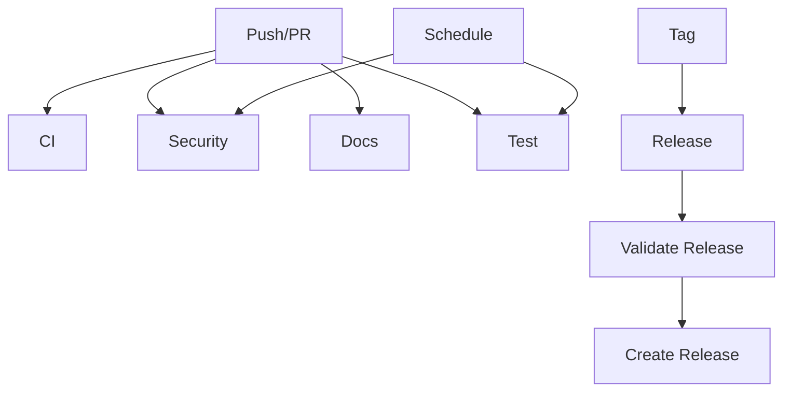

# GitHub Actions Workflows

This directory contains GitHub Actions workflows for the Terraform AWS VPC Flow Logs module.

## Workflows

### 🔄 CI (`ci.yml`)
**Triggers:** Push to main/develop, Pull requests to main/develop

**Purpose:** Continuous Integration pipeline that validates code quality and functionality.

**Jobs:**
- **Terraform Validate**: Validates all examples with different configurations
- **Terraform Lint**: Runs TFLint for code quality checks
- **Security Scan**: Runs tfsecurity for security vulnerability scanning
- **Markdown Lint**: Validates markdown documentation
- **Dependency Review**: Reviews dependencies for security issues (PR only)

### 🔒 Security (`security.yml`)
**Triggers:** Daily schedule, Push to main, Pull requests to main

**Purpose:** Comprehensive security scanning and vulnerability assessment.

**Jobs:**
- **TFSecurity Scan**: Terraform-specific security scanning
- **Checkov Scan**: Infrastructure security analysis
- **Trivy Scan**: File system vulnerability scanning
- **CodeQL Analysis**: Static code analysis for security issues
- **Dependency Check**: Security review of dependencies

### 🚀 Release (`release.yml`)
**Triggers:** Git tags (v*), Manual workflow dispatch

**Purpose:** Automated release process with validation and documentation.

**Jobs:**
- **Validate Release**: Validates all examples before release
- **Create Release**: Creates GitHub release with changelog
- **Terraform Registry**: Prepares Terraform Registry documentation
- **Notify**: Sends release notifications

### 📚 Documentation (`docs.yml`)
**Triggers:** Push to main, Pull requests to main, Manual dispatch

**Purpose:** Validates and maintains documentation quality.

**Jobs:**
- **Validate Docs**: Markdown linting and link checking
- **Generate Terraform Docs**: Auto-generates Terraform documentation
- **Validate Examples**: Ensures example documentation is complete
- **Spell Check**: Validates spelling in documentation
- **Docs Summary**: Provides documentation status summary

### 🧪 Test (`test.yml`)
**Triggers:** Push to main/develop, Pull requests to main/develop, Weekly schedule

**Purpose:** Comprehensive testing suite for the module.

**Jobs:**
- **Unit Tests**: Validates Terraform plans for all examples
- **Integration Tests**: Deploys and tests resources in AWS (PR/main only)
- **Conformance Tests**: Policy-based validation using Conftest
- **Performance Tests**: Measures Terraform performance metrics
- **Test Summary**: Provides test results summary

## Workflow Dependencies



## Required Secrets

For full functionality, the following secrets should be configured in the repository:

### AWS Integration Tests
- `AWS_ACCESS_KEY_ID`: AWS access key for integration tests
- `AWS_SECRET_ACCESS_KEY`: AWS secret key for integration tests

### Optional
- `GITHUB_TOKEN`: Automatically provided by GitHub Actions

## Workflow Permissions

The workflows use the following permissions:

- **Contents**: Read (default), Write (for documentation updates)
- **Actions**: Read (for dependency review)
- **Security Events**: Write (for SARIF uploads)
- **Pull Requests**: Read (for dependency review)

## Local Development

To run similar checks locally:

```bash
# Format and validate
terraform fmt -check -recursive
terraform init
terraform validate

# Security scanning
tfsecurity .
checkov -d . --framework terraform

# Documentation
markdownlint "**/*.md"
terraform-docs markdown table --output-file README.md --output-mode inject .

# Testing
for example in examples/*/; do
  cd "$example"
  terraform init -backend=false
  terraform plan
  cd ../..
done
```

## Troubleshooting

### Common Issues

1. **Terraform Version Mismatch**: Ensure local Terraform version matches workflow version
2. **AWS Credentials**: Integration tests require valid AWS credentials
3. **Resource Limits**: Some tests may hit AWS service limits
4. **Rate Limiting**: GitHub API rate limits may affect some workflows

### Workflow Failures

- Check the specific job logs for detailed error messages
- Ensure all required secrets are configured
- Verify AWS permissions for integration tests
- Check for Terraform state conflicts

## Contributing

When contributing to workflows:

1. Test changes in a fork first
2. Update documentation if workflow behavior changes
3. Ensure backward compatibility
4. Add appropriate error handling
5. Update this README if adding new workflows
