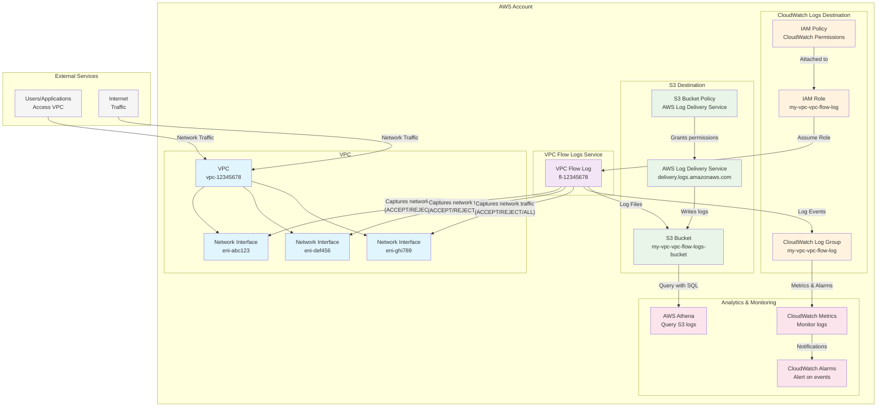

# Terraform AWS VPC Flow Logs

A Terraform module for creating AWS VPC Flow Logs with support for both CloudWatch Logs and S3 destinations. This module provides a flexible and secure way to capture network traffic information from your VPC.

## Features

- **Multiple Destination Types**: Support for CloudWatch Logs and S3 bucket destinations
- **Flexible Configuration**: Choose between ACCEPT, REJECT, or ALL traffic types
- **Secure IAM**: Automatically creates necessary IAM roles and policies with least privilege access
- **Cost Optimization**: Configurable CloudWatch log retention and log group classes
- **S3 Integration**: Automatic S3 bucket creation with proper permissions for AWS log delivery service
- **Tagging Support**: Full tagging support for all resources

## Architecture Overview

The following diagram illustrates how this Terraform module works within AWS to capture and store VPC Flow Logs:



### Data Flow

1. **Traffic Capture**: Network traffic flows through VPC network interfaces (ENIs)
2. **Flow Log Creation**: VPC Flow Logs service captures traffic metadata based on configured traffic type (ACCEPT/REJECT/ALL)
3. **Destination Routing**: Logs are sent to either CloudWatch Logs or S3 based on configuration
4. **Storage & Processing**: 
   - **CloudWatch**: Real-time log storage with configurable retention
   - **S3**: Long-term storage with optional Parquet format for analytics
5. **Analysis & Monitoring**: Logs can be queried, monitored, and alerted upon

### Security & Access Control

- **IAM Roles**: Dedicated service roles with minimal required permissions
- **S3 Policies**: Secure bucket policies allowing only AWS log delivery service
- **Resource Isolation**: Each deployment creates isolated resources
- **Encryption**: Support for encryption at rest and in transit

## Architecture

The module creates the following resources based on your configuration:

### CloudWatch Logs Destination
- CloudWatch Log Group with configurable retention
- IAM Role for VPC Flow Logs service
- IAM Policy with minimal required permissions

### S3 Destination
- S3 Bucket with log delivery write ACL
- S3 Bucket Policy for AWS log delivery service
- Proper permissions for log delivery

## Usage

### Basic Example - CloudWatch Logs

```hcl
module "vpc_flow_logs" {
  source = "path/to/this/module"

  name   = "my-vpc"
  vpc_id = "vpc-12345678"
  
  log_destination_type = "cloud-watch-logs"
  traffic_type         = "ALL"
  
  cloudwatch_destination = {
    retention_in_days = 30
    log_group_class   = "STANDARD"
  }
  
  tags = {
    Environment = "production"
    Project     = "networking"
  }
}
```

### S3 Destination Example

```hcl
module "vpc_flow_logs" {
  source = "path/to/this/module"

  name   = "my-vpc"
  vpc_id = "vpc-12345678"
  
  log_destination_type = "s3"
  traffic_type         = "REJECT"
  
  tags = {
    Environment = "production"
    Project     = "security"
  }
}
```

### Using Existing Destination

```hcl
module "vpc_flow_logs" {
  source = "path/to/this/module"

  name   = "my-vpc"
  vpc_id = "vpc-12345678"
  
  log_destination_type = "cloud-watch-logs"
  log_destination      = "arn:aws:logs:us-west-2:123456789012:log-group:existing-log-group"
  traffic_type         = "ALL"
}
```

## Inputs

| Name | Description | Type | Default | Required |
|------|-------------|------|---------|:--------:|
| name | The name to use for resources | `string` | n/a | yes |
| vpc_id | The ID of the VPC to capture flow logs from | `string` | n/a | yes |
| traffic_type | The type of traffic to capture. Values: ACCEPT, REJECT, or ALL | `string` | `"REJECT"` | no |
| log_destination_type | Logging destination type. Values: cloud-watch-logs or s3 | `string` | `"cloud-watch-logs"` | no |
| log_destination | ARN of the logging destination. If unset (null), the destination will be created | `string` | `null` | no |
| cloudwatch_destination | CloudWatch destination configuration | `object` | `{}` | no |
| cloudwatch_destination.retention_in_days | CloudWatch log retention in days | `number` | `30` | no |
| cloudwatch_destination.log_group_class | CloudWatch log group class: STANDARD, INFREQUENT_ACCESS, or DELIVERY | `string` | n/a | no |
| destination_options | Destination options for advanced configuration | `object` | `{}` | no |
| destination_options.file_format | File format: plain-text or parquet | `string` | `"plain-text"` | no |
| destination_options.hive_compatible_partitions | Enable Hive compatible partitions | `bool` | `false` | no |
| destination_options.per_hour_partition | Enable per-hour partitioning | `bool` | `false` | no |
| tags | Common tags to apply to all resources | `map(string)` | `{}` | no |

## Outputs

| Name | Description |
|------|-------------|
| vpc_flow_logs_bucket_name | The name of the S3 bucket storing the VPC Flow Logs (if S3 destination) |
| cloud_watch_log_group | The name of the CloudWatch log group (if CloudWatch destination) |
| aws_flow_log | The AWS flow log ID |

## Traffic Types

- **ACCEPT**: Only capture accepted traffic
- **REJECT**: Only capture rejected traffic (default)
- **ALL**: Capture all traffic (both accepted and rejected)

## Destination Types

### CloudWatch Logs
- Centralized logging with real-time monitoring
- Configurable retention periods
- Integration with CloudWatch alarms and dashboards
- Cost-effective for short-term storage

### S3
- Long-term storage and archival
- Integration with AWS Athena for querying
- Support for Parquet format for better performance
- Cost-effective for large volumes of data

## Cost Considerations

### CloudWatch Logs
- Pay per GB ingested and stored
- Consider using INFREQUENT_ACCESS class for cost optimization
- Set appropriate retention periods

### S3
- Pay for storage and requests
- Consider lifecycle policies for cost optimization
- Parquet format can reduce storage costs

## Requirements

| Name | Version |
|------|---------|
| terraform | >= 1.0 |
| aws | >= 4.0 |

## Providers

| Name | Version |
|------|---------|
| aws | >= 4.0 |

## Examples

See the [examples](./examples) directory for more detailed usage examples.

## Contributing

1. Fork the repository
2. Create a feature branch
3. Make your changes
4. Add tests if applicable
5. Submit a pull request

## License

This module is licensed under the MIT License. See the [LICENSE](./LICENSE) file for details.

## Changelog

See [CHANGELOG.md](./CHANGELOG.md) for version history and changes.
